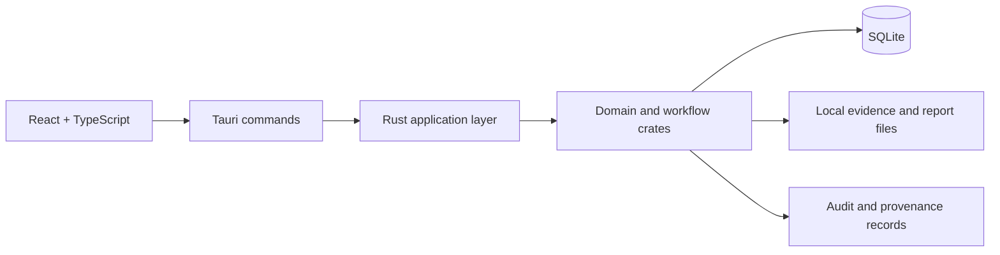

# KRYVORA Architecture Summary

KRYVORA is organized as a modular desktop forensic workstation composed of a React frontend, a Tauri shell, and a Rust workspace that owns the domain logic, persistence, integrity functions, and evidence workflows.

## 1. Repository Layers

| Layer | Location | Responsibility |
|---|---|---|
| Frontend | `frontend/` | React + TypeScript interface and workflow orchestration |
| Desktop integration | `app/` | Tauri application shell and command bridge |
| Domain and workflow crates | `crates/` | Evidence, integrity, sanitization, carving, recovery, jobs, audit, provenance, and reporting |
| Persistence | `crates/kryvora-db/` | SQLite schema, migrations, and repository logic |
| Documentation | `docs/` | Product, workflow, security, architecture, testing, and SIH mapping |

## 2. Execution flow

## 3. Core crate responsibilities

| Crate | Responsibility |
|---|---|
| `kryvora-core` | Shared IDs, errors, and domain state definitions |
| `kryvora-integrity` | Streaming SHA-256 hashing and integrity comparison |
| `kryvora-evidence` | Evidence registration and validation |
| `kryvora-db` | Migrations and repository layer for durable data |
| `kryvora-carving` | Signature scanning and candidate generation |
| `kryvora-recovery` | Validation, classification, and recovered artifact metadata |
| `kryvora-sanitize` | File and directory overwrite workflows and safety checks |
| `kryvora-audit` | Hash-linked event recording and chain verification |
| `kryvora-provenance` | Evidence-to-result relationship graph |
| `kryvora-report` | HTML report generation and record persistence |
| `kryvora-jobs` | Job lifecycle and persisted operation state |
| `kryvora-storage` | File, directory, and target inspection helpers |
| `kryvora-policy` | Safety and policy decision models |
| `kryvora-cli` | Command-line interface for evidence and recovery actions |

## 4. Design principles

- separation of concerns between UI, command layer, and domain logic
- evidence-aware operations that preserve source identity and integrity
- audit-first design for source, recovery, and operational events
- policy-focused safety boundaries for destructive workflows
- transparent status reporting for partial or constrained capabilities

## 5. Operational boundaries

The architecture is intentionally clear about what is implemented and what remains a controlled boundary.

- Evidence registration and verification are implemented for regular files.
- Carving is currently bounded to supported contiguous signatures.
- Sanitization is implemented with explicit result states and safety checks.
- Drive-level erase remains an intentionally disabled execution path rather than an active capability.

## 6. Source of truth

When there is a discrepancy between documentation and behavior, the authoritative source is the code and tests in:

- `app/src/lib.rs` and `app/src/commands.rs`
- `crates/kryvora-db/migrations/`
- the crate `tests/` folders
- the Tauri and frontend route definitions

See also [docs/05_SYSTEM_ARCHITECTURE.md](docs/05_SYSTEM_ARCHITECTURE.md) and [docs/04_SIH_REQUIREMENT_MAPPING.md](docs/04_SIH_REQUIREMENT_MAPPING.md).
