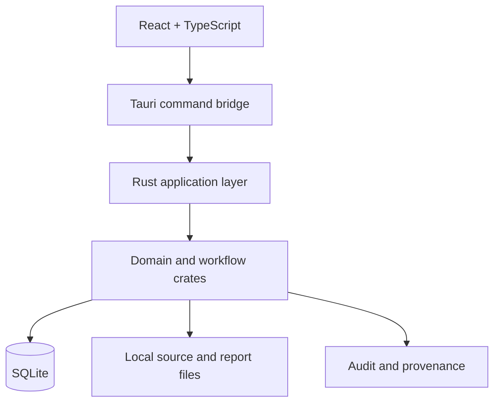

# KRYVORA

Digital Forensics & Secure Data Sanitization Workstation

KRYVORA is a focused Windows desktop forensic workstation designed to connect case context, evidence integrity, recovery validation, auditability, and controlled sanitization workflows in a single security-oriented platform. Built around a Rust backend, SQLite persistence, and a Tauri desktop shell, the system helps examiners preserve source identity, validate recovered artifacts, and maintain a reviewable chain of evidence-related actions.

## Executive Summary

KRYVORA combines a structured case workflow with:

- evidence registration and SHA-256 integrity verification
- bounded signature-based carving for JPEG, PNG, and PDF content
- result validation, provenance tracking, and recovery metadata persistence
- forensic reporting and audit-chain verification
- file and folder sanitization workflows with safety checks and explicit outcome reporting

The platform is intentionally scoped to a practical, defensible evidence-handling workflow: it emphasizes integrity, auditability, and transparent operational boundaries rather than claiming unsupported or unverified capabilities.

## Why KRYVORA

Digital investigation and data sanitization workflows are often fragmented. A case may contain evidence records, hashes, carve results, job lifecycle data, and reports in separate systems or manual notes. KRYVORA addresses this by keeping those artifacts in a common operational context.

The project is designed for:

- investigators who need a reviewable chain from source evidence to recovered artifact
- security teams evaluating preserved evidence and analysis provenance
- forensic workflows that prioritize integrity, validation, and clear reporting
- safety-oriented sanitization operations with explicit operational outcomes and guarded execution boundaries

## Core Capabilities

| Capability | Status | Description |
|---|---|---|
| Case and evidence registration | Implemented | Case creation and regular-file evidence registration with canonical path, size, and SHA-256 data |
| Evidence integrity verification | Implemented | Streaming SHA-256 verification with size comparison and audit logging |
| File carving and recovery | Implemented — Supported Artifact Scope | Operational bounded carving and validated recovery for supported artifact formats, with integrity checks, validation, provenance, and controlled output |
| Provenance and audit trail | Implemented | Persisted evidence-to-candidate-to-artifact relationships and hash-linked event tracking |
| Reporting | Implemented in scope | HTML recovery reporting with metadata persistence and digest capture |
| File and folder sanitization | Implemented & Safety-Controlled | Implemented with target validation, symlink/reparse protection, controlled processing, verification, and explicit outcome states |
| Secure drive sanitization | Controlled / Inspection & Planning Boundary | KRYVORA provides device inspection, target identity assessment, safety policy, and sanitization planning. Physical drive erase execution remains intentionally disabled pending platform-specific validation |
| Validated recovery | Validated Recovery for Supported Formats | Validated recovery is available for the currently supported artifact formats. Unsupported or inconclusive candidates are not represented as successful recovery |
| Fragmented reconstruction | Future Extension | Fragmented-file reconstruction and advanced cross-fragment recovery are future extensions. The current recovery pipeline intentionally stops at the validated supported-artifact boundary |

## Key Features

### Evidence Integrity

KRYVORA records a canonical source path, byte size, and SHA-256 digest when evidence is registered. Re-verification compares current content against the original values before later workflow actions proceed.

### Carving and Validation

The backend scans file content for supported signatures and validates candidate ranges using format-aware logic. Only results that pass validation are promoted to persisted recovery artifacts.

### Audit and Provenance

Every material operation is linked into a local hash chain. This gives the workflow a reviewable, tamper-evident record that helps explain how recovered data relates to the original evidence.

### Sanitization Controls

The sanitizer workflow includes path validation, regular-file checks, symlink protection, and result states such as success, partial, failed, and not verified. The application documents the safety boundary and avoids claiming physical-media destruction guarantees for flash or remapped media.

### Reporting

Tauri report generation persists recovery output and associated metadata so results can be reviewed, re-opened, and tied back to the original evidence and case context.

## End-to-End Forensic Workflow

```mermaid
flowchart LR
    A[Case creation] --> B[Evidence registration]
    B --> C[SHA-256 + file size validation]
    C --> D[Optional re-verification]
    D --> E[Signature scan and candidate detection]
    E --> F[Format validation]
    F --> G[Persisted recovery results]
    G --> H[Evidence → candidate → artifact provenance]
    H --> I[Audit events]
    I --> J[HTML report]
```



## Secure Sanitization Workflow


The sanitization workflow is intentionally conservative. It does not overstate secure erasure guarantees and instead reports the actual outcome.

## Evidence Integrity

KRYVORA uses streamed SHA-256 hashing to maintain integrity and avoid loading the full file into memory. Evidence is stored with both digest and size so that later mismatch detection can distinguish changed content from changed length.

## File Carving & Recovery

The recovery path currently focuses on contiguous signature scanning and validation for:

- JPEG
- PNG
- PDF

Recovered results include offset, length, validation state, confidence metadata, and hash information. The platform emphasizes validated results rather than relying on raw signature hits alone.

## Audit & Provenance

The project stores audit events in a canonical sequence and verifies the chain by recomputing hashes across prior links. Provenance rows connect evidence to candidates and artifacts so investigators can review how a result was produced.

## Reporting

Recovery reports are generated as HTML documents and stored under the app-managed report directory. Each generated report is hashed and recorded with metadata so the output can be reviewed against its original bytes.

## Security Architecture

The backend serves as the trust boundary. Tauri handlers validate cases, IDs, file paths, and command inputs before invoking Rust logic. SQLite and the local filesystem remain the primary persistence boundaries, while the audit chain provides a local tamper-evident record.

## System Architecture



## Technology Stack

- React 18 + TypeScript + Vite
- Tauri 2 desktop shell
- Rust 2021 workspace
- SQLite with rusqlite
- SHA-256 via sha2
- CLI tooling via clap

## SIH Requirement Alignment

| SIH requirement | KRYVORA capability | Implementation status |
|---|---|---|
| Secure drive sanitization | Protected device workflow boundary with inspection and policy models | Controlled boundary; active erase not exposed |
| Secure file and folder erasure | Overwrite workflow with path and integrity checks | Implemented in scope |
| Supported-format carving and recovery | Signature scanning and candidate validation for supported contiguous formats; not filesystem deleted-entry recovery | Implemented — Supported Artifact Scope |
| Forensic analysis | Case-based evidence workflow and investigation results | Operational in scope |
| SHA-256 evidence integrity | Streaming hash generation and comparison | Implemented |
| Validation | Evidence verification and result validation | Implemented |
| Audit trail | Local hash-linked event sequence | Implemented |
| Provenance | Evidence → candidate → artifact graph | Implemented in scope |
| Reporting | HTML recovery reports | Implemented in scope |
| Security and safety controls | Guarded execution and explicit reporting | Implemented with boundaries |

## User Workflow

1. Create a case.
2. Register a regular-file evidence source.
3. Verify SHA-256 and size.
4. Run carving and recovery on supported file types.
5. Review persisted results and provenance.
6. Generate an HTML report.
7. Execute sanitization only against disposable targets and approved workflows.

## Validation & Testing

The repository contains Rust workspace tests covering integrity validation, recovery behavior, audit chain verification, report generation, and sanitization path handling. The current recorded workspace run reported 287 passing tests across 44 suites.

## Performance Evaluation

KRYVORA includes benchmark-oriented evaluation artifacts for synthetic carving and recovery workloads. These measurements are presented as objective baseline evidence, while broader production benchmarking remains a future extension.

## Project Structure

```text
app/                  Tauri desktop application and command layer
crates/               Rust workspace modules for evidence, audit, recovery, sanitation, and reporting
frontend/             React + TypeScript interface
docs/                 Technical documentation and SIH design package
Cargo.toml            Rust workspace definition
ARCHITECTURE.md       Architecture summary
README.md             Project overview and entry point
```

## Installation

Prerequisites:

- Rust toolchain from `rust-toolchain.toml`
- Node.js and npm
- Tauri CLI for desktop development

```powershell
cd frontend
npm install
cd ..
```

## Running KRYVORA

Desktop development:

```powershell
cd app
cargo tauri dev
```

Release build:

```powershell
cd app
cargo tauri build
```

CLI examples:

```powershell
cargo run -p kryvora-cli -- --help
cargo run -p kryvora-cli -- run --db .\case.db --case-title "Case 1" --source .\evidence.bin
cargo run -p kryvora-cli -- carve --db .\case.db --source .\image.bin
cargo run -p kryvora-cli -- verify --db .\case.db
```

## Documentation

- [Project Overview](docs/01_PROJECT_OVERVIEW.md)
- [Problem Statement](docs/02_PROBLEM_STATEMENT.md)
- [Proposed Solution](docs/03_PROPOSED_SOLUTION.md)
- [SIH Requirement Mapping](docs/04_SIH_REQUIREMENT_MAPPING.md)
- [System Architecture](docs/05_SYSTEM_ARCHITECTURE.md)
- [Module Documentation](docs/06_MODULE_DOCUMENTATION.md)
- [Forensic Workflow](docs/07_FORENSIC_WORKFLOW.md)
- [Security Architecture](docs/08_SECURITY_ARCHITECTURE.md)
- [Evidence Integrity](docs/09_EVIDENCE_INTEGRITY.md)
- [Audit and Provenance](docs/10_AUDIT_AND_PROVENANCE.md)
- [User Manual](docs/11_USER_MANUAL.md)
- [Validation and Testing](docs/12_VALIDATION_AND_TESTING.md)
- [Performance Evaluation](docs/13_PERFORMANCE_EVALUATION.md)
- [Threat Model](docs/14_THREAT_MODEL.md)
- [Known Limitations](docs/15_KNOWN_LIMITATIONS.md)
- [Roadmap](docs/16_ROADMAP.md)

## Security Design Principles

- preserve evidence integrity before and after analysis
- accept only explicit and validated workflows
- record all material operations in a local audit chain
- restrict destructive actions to reviewed targets and controlled outcomes
- avoid unsupported claims or guarantees beyond the implemented behavior

## Future Extensibility

The architecture is structured to support expansion in evidence intake, stronger policy enforcement, broader carving coverage, richer provenance, and deeper validation workflows. The current implementation focuses on a disciplined, verifiable first version of the platform.
