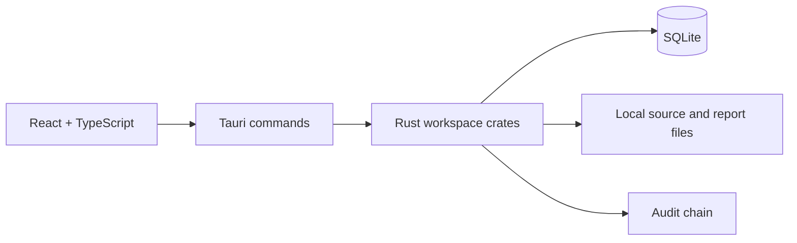

# KRYVORA

**Digital Forensics & Secure Data Sanitization Workstation**

## Executive Summary

KRYVORA is a Windows desktop prototype that connects local case/evidence records, SHA-256 integrity checks, limited signature carving and validation, file/folder overwrite attempts, a hash-linked audit log, and HTML recovery reporting. It is designed to keep source identity and recovery offsets reviewable while making unsupported operations visible. It is not a full forensic acquisition or analysis suite and is not certified for production evidence handling or secure media erasure.

## Problem

Evidence recovery, integrity verification, auditability and sanitization are often treated as separate operations. KRYVORA provides a shared case/evidence and audit context for a bounded subset of those workflows. Drive erasure, acquisition, partition/filesystem parsing and deleted-file analysis are not available. See [02. Problem Statement](docs/02_PROBLEM_STATEMENT.md).

## Solution

The current evidence path is:

```text
CASE → REGULAR-FILE EVIDENCE → SHA-256 → VERIFY → CARVE → VALIDATE
     → PERSIST RESULT/OFFSET → AUDIT → RECOVERY HTML REPORT
```

File/folder sanitization is a separate destructive operation. It reports explicit outcomes and does not claim safe unlink or physical-media erasure. See [03. Proposed Solution](docs/03_PROPOSED_SOLUTION.md) and [07. Forensic Workflow](docs/07_FORENSIC_WORKFLOW.md).

## Core Capabilities

| Capability | Status | Current scope |
|---|---|---|
| Case and evidence registration | IMPLEMENTED | Cases and regular-file source metadata |
| Evidence integrity | IMPLEMENTED | Streaming SHA-256; digest and size comparison |
| Secure file/folder eraser | PARTIAL | Random overwrite attempt, digest comparison, conservative outcomes; safe unlink disabled |
| Secure drive eraser | UNSUPPORTED | No drive-sanitize Tauri command or erase executor |
| File carving/recovery | PARTIAL | Contiguous JPEG, PNG, PDF validation; fully valid ranges are written to app-owned storage with SHA-256 and provenance |
| Audit chain | IMPLEMENTED | Local canonical hash-chain append and verification |
| Reporting | PARTIAL | Tauri recovery HTML report, stored SHA-256 and metadata |
| Jobs | PARTIAL | Rust lifecycle/progress persistence; UI lists persisted jobs |

Status is defined in the [project overview](docs/01_PROJECT_OVERVIEW.md). The formal matrix and coverage counts are in [04. SIH Requirement Mapping](docs/04_SIH_REQUIREMENT_MAPPING.md).

## SIH Requirement Coverage

Ten deliverables are mapped: **4 IMPLEMENTED, 4 PARTIAL, 1 UI WORKFLOW ONLY, 1 UNSUPPORTED**. This is a row count, not a weighted completion percentage. In particular, drive erasure is unsupported; the performance report contains one-run synthetic baselines but no representative study; validation UI does not run the test suite.

## Architecture

The React frontend calls allow-listed Tauri commands. Rust crates own domain logic, SQLite persistence, integrity, evidence, sanitizer, carving/recovery, jobs, audit, provenance and reports.



The Tauri app is an independent Cargo workspace under `app/`. Desktop data lives in the Tauri platform application-data directory. The CLI uses a separate database path by default. See [05. System Architecture](docs/05_SYSTEM_ARCHITECTURE.md).

## Core Workflows

- Create a case, register a regular file, and verify its recorded SHA-256: [User Manual](docs/11_USER_MANUAL.md).
- Run Analyze & Recover against registered evidence in the globally selected case. The backend verifies the evidence's recorded SHA-256 before scanning and associates jobs/results with that case. Only fully valid candidates are written as separate, hash-checked files; partial candidates remain metadata-only.
- Review persisted offsets/results in the Investigation Explorer and generate a recovery HTML report.
- Use file/folder sanitization only on disposable targets; the UI requires target review and typed confirmation, while backend result and path checks remain authoritative.
- Open Drive Eraser only to view its unsupported status; no drive operation is exposed.

## Technology Stack

- React 18, TypeScript, React Router 6, Vite 5.
- Tauri 2.
- Rust 2021; repository toolchain pinned to 1.90.0.
- SQLite via `rusqlite`; SHA-256 via `sha2`.
- Rust CLI via `clap`.

## Installation

Prerequisites: Rust toolchain from `rust-toolchain.toml`, Node.js/npm, and Tauri CLI v2 for desktop development. From the repository root:

```powershell
cd frontend
npm install
cd ..
```

## Usage

Run the desktop application from `app/`:

```powershell
cd app
cargo tauri dev
```

Build configured Windows MSI/NSIS packages:

```powershell
cd app
cargo tauri build
```

CLI examples from repository root:

```powershell
cargo run -p kryvora-cli -- --help
cargo run -p kryvora-cli -- run --db .\case.db --case-title "Case 1" --source .\evidence.bin
cargo run -p kryvora-cli -- carve --db .\case.db --source .\image.bin
cargo run -p kryvora-cli -- verify --db .\case.db
```

Use disposable files for sanitization tests. A browser-only Vite page does not have the Tauri IPC bridge; use the desktop host to exercise backend commands.

## Validation

The Validation Center displays persisted evidence/recovery states and calls the audit-chain verifier. It does not execute tests, verify stored reports, or validate sanitization certificates. See [12. Validation and Testing](docs/12_VALIDATION_AND_TESTING.md).

## Testing

The recorded workspace run on 2026-09-30 completed **287 tests across 44 suites**. Formatting, workspace check, strict Clippy, frontend production build and separate Tauri crate check passed in that session. These are development checks, not GUI E2E or production certification.

```powershell
cargo fmt --all -- --check
cargo check --workspace
cargo test --workspace --quiet
cargo clippy --workspace --all-targets -- -D warnings
cd frontend
npm run build
cd ..\app
cargo check
```

## Security

The backend is the security boundary. Evidence hashing is streamed; report names are confined to the app-owned reports directory; audit rows form a verifiable local hash chain. The sanitizer Tauri handlers require a boolean confirmation and perform path/system checks, but they do not invoke the separate policy evaluator; the UI's typed phrase is not backend-validated. The local audit chain has no external signature/anchor. See [08. Security Architecture](docs/08_SECURITY_ARCHITECTURE.md) and [14. Threat Model](docs/14_THREAT_MODEL.md).

## Documentation

The [Documentation Coverage Matrix](docs/DOCUMENTATION_COVERAGE_MATRIX.md) maps every document to SIH requirements and source evidence.

1. [Project Overview](docs/01_PROJECT_OVERVIEW.md)
2. [Problem Statement](docs/02_PROBLEM_STATEMENT.md)
3. [Proposed Solution](docs/03_PROPOSED_SOLUTION.md)
4. [SIH Requirement Mapping](docs/04_SIH_REQUIREMENT_MAPPING.md)
5. [System Architecture](docs/05_SYSTEM_ARCHITECTURE.md)
6. [Module Documentation](docs/06_MODULE_DOCUMENTATION.md)
7. [Forensic Workflow](docs/07_FORENSIC_WORKFLOW.md)
8. [Security Architecture](docs/08_SECURITY_ARCHITECTURE.md)
9. [Evidence Integrity](docs/09_EVIDENCE_INTEGRITY.md)
10. [Audit and Provenance](docs/10_AUDIT_AND_PROVENANCE.md)
11. [User Manual](docs/11_USER_MANUAL.md)
12. [Validation and Testing](docs/12_VALIDATION_AND_TESTING.md)
13. [Performance Evaluation](docs/13_PERFORMANCE_EVALUATION.md)
14. [Threat Model](docs/14_THREAT_MODEL.md)
15. [Known Limitations](docs/15_KNOWN_LIMITATIONS.md)
16. [Roadmap](docs/16_ROADMAP.md)

## Current Status

Version 0.1.0 prototype. The repository includes a desktop UI, Rust CLI, SQLite persistence, core evidence/integrity/audit/recovery/report components and tests. Detailed status by deliverable is in [04](docs/04_SIH_REQUIREMENT_MAPPING.md).

## Known Limitations

No drive erase, forensic image acquisition, filesystem/partition/deleted-file analysis, fragmented-file reconstruction, performance collector, GUI E2E suite or report digest verification command. File/folder overwrite is partial and does not establish physical erasure. See [15](docs/15_KNOWN_LIMITATIONS.md).

## Roadmap

The roadmap prioritizes policy wiring, evidence/report/job relationship completeness, report verification, expanded validated carving, performance instrumentation and production security review. See [16](docs/16_ROADMAP.md).

## Screenshots

No committed screenshot set is included in this repository snapshot. Capture the native desktop application with a clearly labeled synthetic/disposable case, including dashboard, evidence verification, recovery result, audit status, and the unsupported drive-erasure screen. Do not use fabricated artifacts or hashes.

## Project Structure

```text
app/                  Tauri desktop application and commands
crates/               Rust domain, storage, integrity, audit and workflow crates
frontend/             React + TypeScript UI
docs/                 SIH technical documentation package
Cargo.toml            Rust workspace
ARCHITECTURE.md       Architecture summary
```

## Development

Rust workspace members are at repository root. `app/` is an independent Cargo workspace that consumes them by path. Run Rust checks from root; run `cargo tauri dev` from `app/`; run `npm run build` from `frontend/`. Keep generated databases and evidence fixtures non-sensitive and disposable.

## License

Workspace package metadata declares `MIT OR Apache-2.0`. Confirm the corresponding license texts and notices are present in the distribution before redistributing; this repository snapshot does not include a root `LICENSE` file.