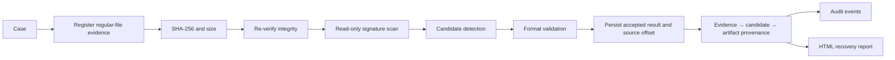
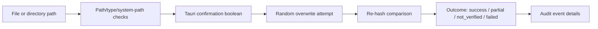

# 03. Proposed Solution

## 3.1 Concept

KRYVORA integrates a case/evidence registry, evidence integrity checks, limited file carving and validation, file/folder overwrite attempts, audit records and recovery reporting behind a Rust backend. React is the presentation layer; Tauri exposes a bounded set of commands; Rust crates own domain, persistence and operation logic.

The conceptual investigation path is:

The implemented carve command creates a new case and evidence record from its supplied title/source; it does not consume the globally selected UI case. The frontend must not imply otherwise.

## 3.2 Design principles

1. **Safety**: source registration accepts a regular file; sanitization protects selected system paths and verifies a post-overwrite digest. These controls do not amount to drive-level safety validation.
2. **Evidence preservation**: analysis reads the source, then the carve orchestration hashes it again and discards results if its size or digest changed during processing.
3. **Verification**: evidence comparison checks both SHA-256 and size. Candidate validation uses format validators; a raw signature is only a candidate.
4. **Explainability**: recovery rows store validation state, facts, recovery method, confidence level and confidence reasons. The current Tauri result DTO exposes only a subset.
5. **Provenance**: accepted recovery results are linked to evidence through a candidate node; job/report relationships are incomplete.
6. **Auditability**: audit rows include canonical event fields and previous/current hashes. A local chain does not prevent a privileged actor from rewriting the database and recomputing the chain.

## 3.3 Separate sanitization path

Sanitization is not part of read-only analysis. The current Tauri file/folder commands require a confirmation boolean and invoke overwrite implementations. The UI adds a target review and typed phrase, but the backend command does not validate that phrase and does not call the separate `kryvora-policy` evaluator. The backend's own path/type/system-path checks remain the enforcement boundary; see [08](08_SECURITY_ARCHITECTURE.md).

Drive erasure is not an executable branch: device enumeration and policy models are not registered as Tauri commands, and there is no raw-device erase implementation.

## 3.4 Operating model

SQLite data and generated reports are stored under the Tauri platform application-data directory. The Rust CLI has its own database-path behavior. Evidence files remain at their original path; registration stores metadata and a digest rather than copying or acquiring an image. Reports are generated separately under the app-owned reports directory by the Tauri command.

## 3.5 Current boundary

Current implementation status: [01](01_PROJECT_OVERVIEW.md), requirement traceability: [04](04_SIH_REQUIREMENT_MAPPING.md), architecture: [05](05_SYSTEM_ARCHITECTURE.md), workflow: [07](07_FORENSIC_WORKFLOW.md), limitations: [15](15_KNOWN_LIMITATIONS.md).
