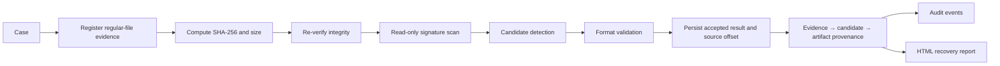
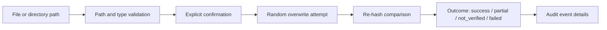

# 03. Proposed Solution

## 3.1 Concept

KRYVORA integrates a case-based evidence register, integrity verification, bounded recovery workflows, audit chaining, and controlled sanitization into a single desktop platform. The system uses a Rust backend for enforcement and persistence, with a React/Tauri frontend that exposes the operational surface in a disciplined way.

The conceptual investigation path is:

## 3.2 Design Principles

1. Safety: source registration and sanitization operate under explicit checks and conservative outcome states.
2. Evidence preservation: the analysis path validates source integrity before any result is considered trustworthy.
3. Verification: both digest and byte size are compared before a result is accepted as valid.
4. Explainability: recovered results retain validation state, offset metadata, confidence reasons, and provenance links.
5. Auditability: the local event log is chained and verifiable through canonical hashing.
6. Transparency: unsupported or intentionally restricted actions are documented as operational boundaries, not hidden limitations.

## 3.3 Sanitization Path

Sanitization is treated as a distinct workflow from read-only analysis. The file and folder commands run with path validation, system-path protections, and explicit result classification. The platform reports success, partial, failed, or not-verified outcomes rather than overselling destructive completion.

Drive erasure is not exposed as an active desktop workflow; storage inspection and policy concepts remain in the codebase as a controlled safety boundary.

## 3.4 Operating Model

SQLite data and generated reports are stored in the platform application-data directory for the desktop host. The command-line interface uses its own database path behavior. The evidence model preserves the original file location and metadata rather than copying or manufacturing a separate forensic image.

## 3.5 Current Boundary

The current implementation is documented in the project overview, SIH mapping, architecture documentation, workflow guide, and limitation inventory. The repository remains the definitive authority on actual behavior.
