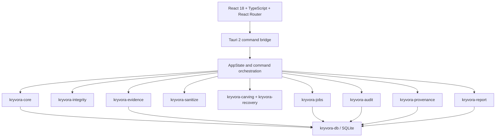

# 05. System Architecture

## 5.1 Component architecture

The repository is a Rust workspace for domain/backend crates plus an independent `app/` Cargo workspace that consumes those crates as path dependencies. `frontend/` is a React/Vite package built into the Tauri application. Tauri handlers in `app/src/lib.rs` are thin IPC wrappers; business logic is primarily in the workspace crates.



## 5.2 Runtime and persistence

At startup, Tauri resolves the platform application-data directory, creates it, and configures `AppState` with `kryvora.db`. Generated Tauri reports go into a sibling `reports/` directory. `crates/kryvora-db/migrations/0001_initial.sql` creates case, evidence, job and audit tables; migrations 0002 and 0003 add provenance/recovery and reports. IDs are UUID-v4 strings, timestamps are stored as text, and hashes as lowercase hex strings. Foreign keys use `ON DELETE RESTRICT`.

The CLI is a separate binary and uses `./kryvora.db` by default unless `--db` or `KRYVORA_DB` is supplied. Do not assume the CLI and desktop use the same database.

## 5.3 Tauri boundary

The registered handlers are: `verify_chain`, `list_cases`, `create_case`, `list_evidence_for_case`, `register_evidence`, `verify_evidence`, `hash_file`, `sanitize_file`, `sanitize_folder`, `carve_source`, `list_recovery_results`, `list_jobs`, `list_audit_events`, `list_reports`, and `generate_report`. There is no handler for raw device enumeration, drive sanitization, image acquisition, partition parsing or filesystem analysis.

The frontend invokes these commands through `@tauri-apps/api/core`. A normal browser-hosted Vite page has no Tauri IPC runtime, so backend calls fail outside the desktop host; the browser preview is suitable for layout checks, not IPC acceptance tests.

## 5.4 Data flows

### Evidence

```mermaid
sequenceDiagram
    participant UI as React UI
    participant T as Tauri command
    participant I as integrity crate
    participant E as evidence crate
    participant DB as SQLite
    UI->>T: register_evidence(case, path, notes, actor)
    T->>T: canonicalize path and require regular file
    T->>I: stream source through SHA-256
    T->>E: register metadata + hash + size + read_only=true
    E->>DB: insert evidence row
    T->>DB: ensure evidence provenance root; append audit event
    T-->>UI: evidence id, path, size, digest, state
```

Reverification opens the recorded source path, recomputes the digest and size, compares them, and appends an `IntegrityVerified` event. The evidence database row is not updated with the new verification state.

### Recovery

`carve_source` accepts a source path and case title, opens a regular file, computes its digest, creates a new case/evidence record, runs carving and recovery jobs, then re-hashes the source. A changed source causes an integrity error and the savepoint is rolled back. Accepted results are persisted with offsets and provenance. `carve_source` does not use the globally selected UI case.

### Jobs and audit

The jobs crate persists lifecycle transitions and progress and appends lifecycle events. The UI exposes listing, not job creation/cancellation controls. Audit verification reads ordered events, checks contiguous sequence, previous-hash links, valid fields and recomputed hashes, then returns Empty/Intact/Broken.

### Reports

Tauri report generation validates an HTML filename, confines output to the app-owned reports directory, refuses symlink directories and creates files without replacement. The report crate renders UTF-8 HTML, syncs it and computes SHA-256; Tauri stores report metadata and appends `ReportGenerated`. There is no Tauri report verification or export command.

## 5.5 Database tables

| Table | Purpose |
|---|---|
| `cases` | Case title, examiner, notes, created/updated timestamps |
| `evidence` | Case link, source type/path, size, hash algorithm/digest, state, read-only flag, tool version, optional metadata/notes |
| `jobs` | Type, state, progress, configuration/checkpoint, error, lifecycle timestamps, optional case/evidence links |
| `audit_events` | Sequence, event metadata, details, previous/current hashes |
| `provenance_nodes` | Typed evidence/candidate/job/artifact/report references with parent links |
| `recovery_results` | Evidence, optional job/provenance links, offset/length, type/category, validation, confidence, method, reconstruction state, artifact hash and facts |
| `reports` | Optional case/job link, kind, path, SHA-256, byte size, creation time |

## 5.6 Cross references

See [06. Module Documentation](06_MODULE_DOCUMENTATION.md), [09. Evidence Integrity](09_EVIDENCE_INTEGRITY.md), [10. Audit and Provenance](10_AUDIT_AND_PROVENANCE.md), and [15. Known Limitations](15_KNOWN_LIMITATIONS.md).
