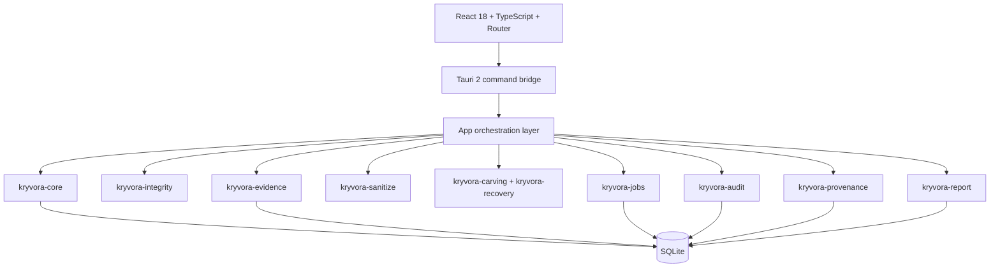
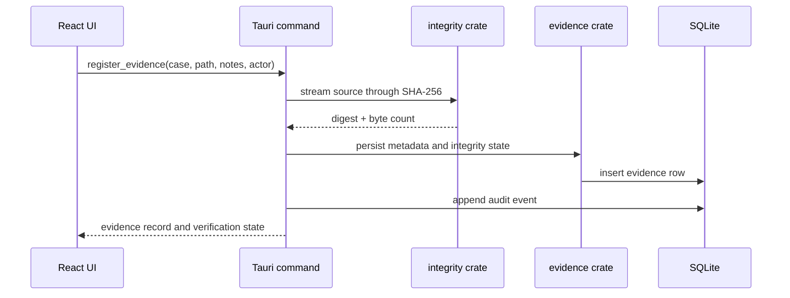

# 05. System Architecture

## 5.1 Component Architecture

The repository is a Rust workspace for the backend and an independent Tauri workspace for the desktop shell. The frontend is a React + TypeScript application that invokes the backend through Tauri commands. The actual business logic remains in the Rust crates, which keeps the UI thin and the evidence logic centralized.

## 5.2 Runtime and Persistence

At startup, the Tauri host resolves the platform application-data directory and configures the local SQLite database. Generated reports are stored in the app-managed report directory. The CLI uses its own default database path and can be pointed at a different location with a runtime parameter.

## 5.3 Tauri Boundary

The registered Tauri handlers include evidence registration and verification, sanitization commands, carving and recovery queries, audit verification, and report generation. The active command set is intentionally bounded and does not expose raw device erase or forensic acquisition operations.

## 5.4 Data Flows

### Evidence flow

### Recovery flow

The recovery flow loads a registered source, verifies its expected digest and size, scans known signatures, validates candidate ranges, and persists accepted artifacts with provenance metadata. A source mismatch or change during processing aborts the result path.

### Audit and reporting flow

The jobs crate records state transitions, while the audit layer writes canonical event rows with hash-chained references. Recovery and report generation add related event records and persist metadata for later review.

## 5.5 Database Tables

| Table | Purpose |
|---|---|
| `cases` | Case title, examiner, notes, timestamps |
| `evidence` | Source path, size, digest, integrity state, metadata |
| `jobs` | Operation lifecycle, progress, checkpoints and status |
| `audit_events` | Sequence, event metadata, previous/current hashes |
| `provenance_nodes` | Evidence/candidate/artifact graph relationships |
| `recovery_results` | Candidate validation data, offset, hash and confidence |
| `reports` | Stored report path, hash, size and metadata |

## 5.6 Cross References

- [06. Module Documentation](06_MODULE_DOCUMENTATION.md)
- [09. Evidence Integrity](09_EVIDENCE_INTEGRITY.md)
- [10. Audit and Provenance](10_AUDIT_AND_PROVENANCE.md)
- [15. Known Limitations](15_KNOWN_LIMITATIONS.md)
