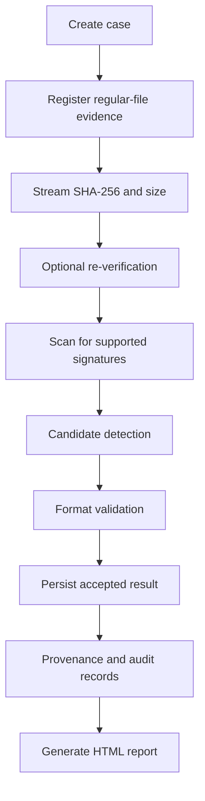

# 07. Forensic Workflow

## 7.1 Case to Recovery Report

### Procedure

1. Create a case and select the operational context.
2. Register a regular file by path, preserving canonical metadata and digest values.
3. Re-verify the source if required, comparing both SHA-256 and byte length.
4. Run a signature scan against known supported file types.
5. Validate candidate ranges and persist accepted results with offsets and provenance.
6. Review results and generate an HTML recovery report for the case.

## 7.2 Sanitization Workflow

Use disposable test targets only. The workflow is built for a controlled, reviewable erase attempt rather than a claim of physical-media sanitization certainty.

## 7.3 Drive Sanitization Boundary

A drive-level sanitization flow is intentionally represented as a controlled boundary, not an active workflow. The project contains device inspection and policy logic, but it does not expose a working device wipe command in the desktop app.

## 7.4 Workflow Status

| Stage | Status |
|---|---|
| Case and evidence registration | Implemented |
| SHA-256 calculation and verification | Implemented |
| Contiguous signature carving and validation | Partial |
| File/folder overwrite workflow | Partial |
| Drive sanitization | Controlled boundary |
| Recovery report generation | Implemented in scope |

See also [06. Module Documentation](06_MODULE_DOCUMENTATION.md) and [15. Known Limitations](15_KNOWN_LIMITATIONS.md).
