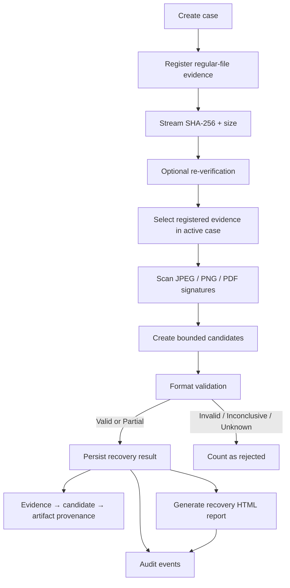
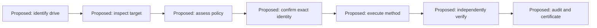

# 07. Forensic Workflow

## 7.1 Workflow A — case to recovery report

### Procedure and scope

1. Create a case in Cases & Evidence with a title and optional examiner.
2. Register a regular file by entering its path. The backend canonicalizes the path, streams SHA-256, records byte size, sets `read_only=true`, and creates an evidence root/audit event.
3. Use Verify to re-hash the registered path. The command returns expected and actual hashes/sizes and appends an integrity event; it does not mutate the evidence row.
4. Select registered evidence from the active case in Analyze & Recover. The backend resolves the source path from the evidence row, checks case ownership, and compares SHA-256 and size before scanning.
5. The backend scans bounded windows for supported signatures, validates candidate ranges, persists results with job/evidence linkage and provenance, and rechecks the source digest/size. A source change prevents result persistence.
6. Fully valid candidates are copied to the app-owned `recovered/` directory using exclusive file creation, then re-hashed before path/hash/validation/job/provenance are persisted. Partial candidates remain metadata-only. Review persisted paths and hashes in Analyze & Recover or Investigate, and generate a recovery report for a case in Reports.

**Progress, cancellation and limits:** the Rust carving job API supports cooperative cancellation at read-window checkpoints, but the Tauri command/UI does not expose a cancellation control or live persisted progress. The desktop command runs until completion. The default scan stops at 4 GiB, 10,000 candidates, or 4,096 open headers; the response reports whether a limit was reached or headers were omitted. A capped scan is incomplete and must not be interpreted as a complete examination.

**Expected result:** persisted case/evidence and, if actual candidates validate, recovery rows with offsets and hashes. Zero candidates is a valid result. **Warning:** a candidate/signature is not proof of a complete file. The current UI does not implement partition, filesystem or deleted-entry analysis.

## 7.2 Workflow B — file/folder sanitization

```mermaid
flowchart LR
    T[Enter file or folder path] --> R[Review target details in UI]
    R --> P[Type SANITIZE in UI]
    P --> C[Tauri command confirm=true]
    C --> B[Backend path/type/system-path checks]
    B --> W[Random overwrite attempt]
    W --> H[Sync and compare new digest]
    H --> O[Return explicit outcome]
    O --> A[Append audit details]
```

Use disposable test targets only. The backend receives a boolean confirmation; it does not verify the phrase typed in the UI, and the separate policy evaluator is not called by these Tauri commands. The typed phrase is therefore a UX safeguard, not the full policy enforcement model. Safe unlink is disabled, so do not expect a successful delete. On flash media, overwrite does not prove the original physical cells are erased. See [06](06_MODULE_DOCUMENTATION.md) and [08](08_SECURITY_ARCHITECTURE.md).

## 7.3 Workflow C — drive sanitization

Every stage above is **NOT IMPLEMENTED in the desktop workflow**. Rust storage inspection and pure policy types exist, but the app has no Tauri device-inspection or drive-sanitize command. The diagram is a design target, not an available procedure. Do not connect a drive expecting KRYVORA to erase it.

## 7.4 Event and report relationship

Evidence registration and re-verification append audit events. Jobs append lifecycle events. Recovery appends recovery/artifact events, and accepted results get provenance rows. Sanitization appends outcome details from the file routine. Report generation stores a recovery report and adds a report event. Event coverage and job/report provenance are not complete; see [10](10_AUDIT_AND_PROVENANCE.md).

## 7.5 Workflow status

| Stage | Status |
|---|---|
| Case and regular-file evidence registration | IMPLEMENTED |
| SHA-256 calculation and verification | IMPLEMENTED |
| Contiguous signature carving and validation | PARTIAL |
| Deleted file, partition or filesystem analysis | UNSUPPORTED |
| File/folder overwrite attempt | PARTIAL |
| Drive sanitization | UNSUPPORTED |
| Recovery HTML report | IMPLEMENTED for current report command scope |
| Sanitization certificate/report through Tauri | NOT IMPLEMENTED |
