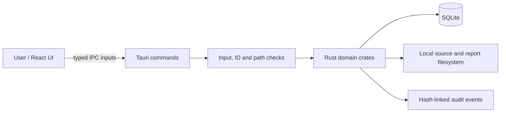

# 08. Security Architecture

## 8.1 Trust Boundaries

The front end is treated as an untrusted presentation layer, while the Rust backend remains the system trust boundary. Tauri commands validate user input and then invoke Rust logic for file access, hashing, persistence, and recovery operations. SQLite and the local filesystem are the primary local resources under protection.

## 8.2 Implemented Safeguards

- command allow-list within the Tauri application
- path-type validation for evidence and report operations
- streaming SHA-256 hashing for integrity checks
- local audit-chain verification through chained hash values
- explicit outcome states for destructive workflows
- app-owned report directory restrictions and guarded output behavior
- regular-file preservation and symlink-aware handling in sanitization logic

## 8.3 Safety Model and Boundaries

KRYVORA is designed around honest, reviewable boundaries. The sanitizer workflow does not claim full physical eradication of data on flash or remapped media. Instead, it classifies the result and preserves the evidence trail associated with the operation.

The application also keeps drive erasure behind an explicit safety boundary rather than exposing a raw erase function without policy and verification controls.

## 8.4 Fail-Closed Behavior

Operations fail on invalid IDs, unsupported file types, mismatched digests, permission errors, or unsafe paths. The system surfaces the actual status rather than converting partial conditions into an overly optimistic success result.

## 8.5 Local Audit Integrity

The local audit chain is designed to detect tampering within the repository data store, but it remains a local integrity mechanism rather than an externally anchored signing system. This is an important distinction: the chain demonstrates consistency within the database, not cryptographic attestation to a third-party authority.

## 8.6 Security Considerations

The project does not claim a full production security review, enterprise access-control model, or independent hostile-environment certification. The platform is best understood as a structured and auditable internal forensic workstation with clear operational boundaries and explicit limitations.

See [14. Threat Model](14_THREAT_MODEL.md) and [15. Known Limitations](15_KNOWN_LIMITATIONS.md).
