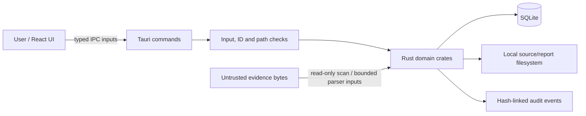

# 08. Security Architecture

## 8.1 Trust boundaries

The React frontend is untrusted input/presentation. Tauri IPC is the only frontend-to-Rust boundary. Rust commands open local paths, validate identifiers and call crates; SQLite and the filesystem are local resources. The frontend does not receive raw-device APIs, and no device-sanitize command is registered.

## 8.2 Implemented safeguards

- **Command allow-list:** handlers are explicitly registered in `app/src/lib.rs`; arbitrary shell execution is not exposed through the frontend API.
- **CSP:** Tauri config restricts default sources and scripts; inline styles are allowed. Review CSP changes as part of release hardening.
- **Input validation:** case/evidence UUIDs are parsed; evidence must resolve to a regular file; empty source paths and mismatched hash sizes are rejected by domain/repository checks.
- **Evidence handling:** evidence source registration is read/hash-only, records `read_only=true`, and recovery checks digest and byte size before/after the scan.
- **Hashing:** source hashing uses streaming SHA-256 with bounded buffering. Verification compares both digest and size.
- **Audit:** canonical event fields are hashed with the previous hash; chain verification detects sequence gaps, link mismatches, current-hash mismatches and malformed rows.
- **Report path:** generated names are restricted to an HTML filename character set and app reports directory; symlink report directories are rejected and file creation refuses replacement.
- **Sanitization path checks:** system paths, file type, read-only state, symlink/reparse points and opened-handle/path identity are checked before overwrite. Write and sync failures are reported rather than silently declared successful.
- **Rust guardrails:** workspace lint configuration forbids unsafe code and denies panic/unwrap/todo/unimplemented lints for workspace targets; this does not audit third-party dependencies or automatically cover every platform/API boundary.

## 8.3 Destructive-operation safeguards and gap

The sanitizer crate has tests for target restrictions and overwrite outcomes. However, the **Tauri commands do not call `kryvora-policy::evaluate`**. They require `input.confirm: bool`; for folders the UI's typed `SANITIZE` text is converted to that boolean and is not independently validated by Rust. Therefore:

1. Target identity is a caller-supplied path, not an inspected device identity.
2. The backend rechecks path and file/directory properties, but the separate policy warning/confirmation assessment is not enforced in the handler.
3. The drive-device confirmation model is not used by any application command.
4. The UI phrase does not constitute a backend typed-phrase control.

This is a documented hardening gap, not a production safety claim. Do not use the current prototype for irreplaceable data.

## 8.4 Fail-closed and error behavior

Invalid IDs, unsupported paths, permission errors, target changes during open, and report-path violations return command errors. Sanitization results distinguish success, partial, failed, not verified and unsupported. These states should remain visible to the examiner; do not convert them to a generic success toast.

The audit chain has no external signing key, remote append-only store or trusted timestamp anchor. A privileged actor who can rewrite the database can potentially rewrite the whole chain. The chain detects inconsistency relative to its stored rows; it does not prove who operated the host or when independently.

## 8.5 Secrets and dependencies

The current product has no documented credential store or user-account/role system; do not put secrets in case notes or actor fields. `Cargo.lock` and the frontend lockfile should be retained for reproducibility. This documentation pass did not perform a dependency vulnerability audit, code-signing review, penetration test or release supply-chain assessment.

## 8.6 Required production hardening

Before production use: wire typed policy assessments into Tauri commands; add device identity binding and a separately reviewed drive executor or keep the feature disabled; add per-operation authorization; test path races and platform-specific filesystem behavior; anchor audit heads outside the writable database; verify report digests on demand; review Tauri capabilities/CSP and dependency advisories; and run independent security assessment. See [14](14_THREAT_MODEL.md) and [16](16_ROADMAP.md).
