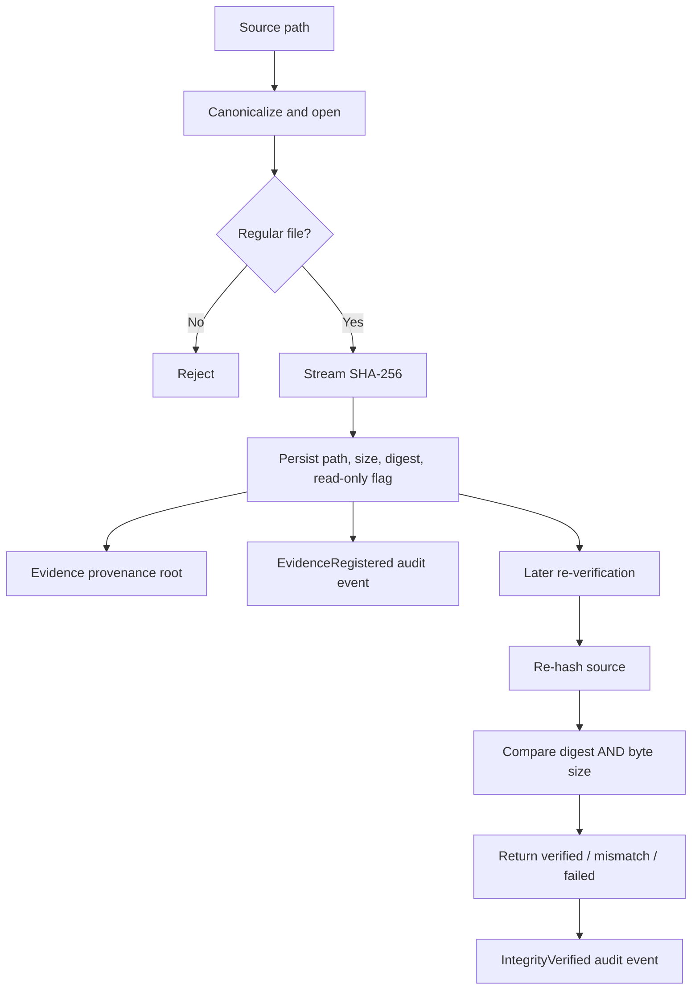

# 09. Evidence Integrity

## 9.1 Registration flow

Tauri `register_evidence` accepts a case ID, path, optional notes and actor. It parses the case UUID, canonicalizes/opens the path, requires a regular file, streams its contents through SHA-256, derives byte size from the hash input, validates the case exists, and persists an evidence record. The stored record includes source type (`file`), canonical path, size, algorithm/digest, integrity state (`verified` at registration), `read_only=true`, tool version and optional notes/metadata. Registration also creates/reuses an evidence provenance root and appends `EvidenceRegistered`.

## 9.2 Hash contract

- Algorithm: SHA-256 (`kryvora-integrity` uses `sha2`).
- Encoding: lowercase hexadecimal digest, expected length 64 characters.
- Input size: number of bytes consumed by the streaming reader.
- Default buffer: 1 MiB; memory is bounded by the chosen buffer plus hash state.
- Verification result: `Verified` only when both digest and size match; `Mismatch` when either differs; read errors become `Failed`.

Known-vector tests include empty input and `abc`, along with multi-buffer digest consistency and size mismatch. See `crates/kryvora-integrity/tests/nist_vectors.rs` and `src/streaming.rs` tests.

## 9.3 Re-verification semantics

`verify_evidence` reopens the stored path and computes a fresh digest/size. It returns expected and actual values and appends an audit event. It does **not** update `evidence.integrity_state`, `created_at`, or another latest-verification field. The verification timestamp is the audit event timestamp; the frontend response itself contains no timestamp. Preserve the audit event when presenting the verification result.

## 9.4 Analysis preservation

The Tauri carving path hashes the input before processing and again after carving/recovery. If size or digest differs, it returns an integrity-mismatch error and rolls back the carving savepoint. The scanner reads data and does not write carved bytes back to the source. The current recovery code persists metadata/offsets and digests, not user-selectable reconstructed files into an export location.

“Read-only” is a recorded evidence attribute and a workflow invariant; it is not an OS-level immutable bit or forensic write blocker. The application registers paths to regular files and does not acquire a physical image.

## 9.5 Evidence record fields and availability

| Field | Stored / returned | Notes |
|---|---|---|
| Evidence ID and case ID | Yes | UUID-v4 strings |
| Canonical source path | Yes | Regular-file path; can become unavailable later |
| SHA-256 and size | Yes | Hash and input byte count at registration |
| Integrity state | Yes | Initially `verified`; re-verification result is returned/audited, not written back |
| Read-only flag | Yes | Stored as true by Tauri registration |
| Tool version | Yes | App package version |
| Hash calculation timestamp | Not a dedicated evidence column | Registration created timestamp is stored; do not describe it as an independently recorded hash timestamp |
| Acquisition metadata | Schema supports optional JSON | Tauri registration currently sends none; there is no acquisition workflow |
| Job/operation link | Partial | Jobs and audit events exist; evidence verification itself has no job ID |

## 9.6 Limitations

Path-based evidence depends on the source remaining available and resolving to the same content. The database does not contain a copied forensic image, hardware write-blocker attestation, chain-of-custody signature, external timestamp, or independently protected hash manifest. A local administrator can alter local files and database state. See [08](08_SECURITY_ARCHITECTURE.md) and [15](15_KNOWN_LIMITATIONS.md).
