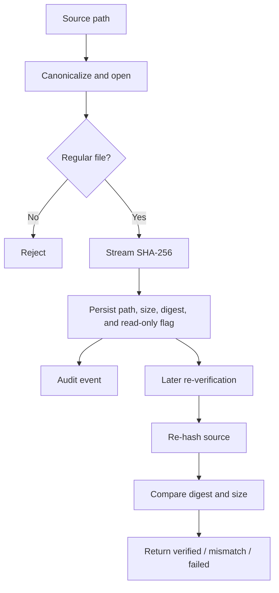

# 09. Evidence Integrity

## 9.1 Registration Flow

Evidence registration accepts a case ID, file path, optional notes, and actor metadata. The backend canonicalizes the file path, requires a regular file, streams the source through SHA-256, records the file size, and persists the evidence record together with its integrity state and metadata.

## 9.2 Hash Contract

- algorithm: SHA-256
- encoding: lowercase hexadecimal string
- size: recorded as the source byte length consumed during hashing
- verification semantics: both hash and size must match before a result is called verified

## 9.3 Re-verification Semantics

The verification flow reopens the stored source and compares the current digest and size to the original evidence record. This preserves the chain of evidence and keeps the verification event visible without rewriting the stored evidence state.

## 9.4 Analysis Preservation

The recovery path re-hashes the original source before and after evidence processing. If the source changes during analysis, the system treats the result as invalid and aborts the operation rather than silently continuing.

## 9.5 Evidence Record Fields

| Field | Meaning |
|---|---|
| Evidence ID | Unique evidence record reference |
| Case ID | Parent case context |
| Canonical path | Resolved source path |
| Size | Byte length at registration |
| SHA-256 | Digest at registration |
| Integrity state | Current workflow state |
| Read-only flag | Marker that source registration is evidence-preservation oriented |
| Tool version | Application version context |

## 9.6 Integrity Message

KRYVORA's integrity model is deliberately grounded in repeated verification and honest result reporting. It does not claim external witness attestation or hardware write-blocker proof; instead, it preserves a transparent, reviewable chain of evidence state.
