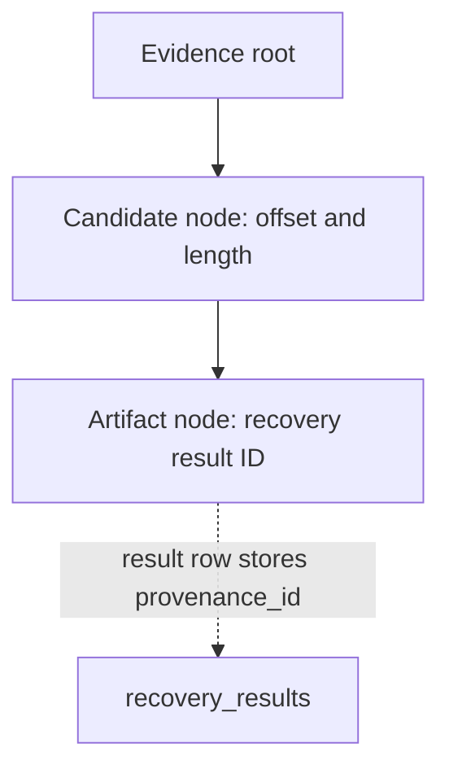

# 10. Audit and Provenance

## 10.1 Audit event model

`audit_events` stores an event ID, monotonically allocated sequence, event type, optional actor/object/job IDs, JSON details, timestamp, previous hash and current hash. The first row uses a 64-zero genesis value. The hash is computed over canonical event data, including previous hash, sequence, event type, timestamp, actor, object ID, job ID and details. Appending allocates the sequence and reads the chain tip under a database write transaction/savepoint.

The event taxonomy defines 17 kinds: `case_created`, `evidence_registered`, `hash_calculated`, `integrity_verified`, job lifecycle events, target/sanitization events, recovery/candidate/artifact events, `report_generated` and `examiner_note`. A taxonomy entry is not proof that every associated UI workflow exists. Current desktop emissions include case creation, evidence registration, integrity verification, job lifecycle, recovery/artifact validation, sanitizer outcome details and recovery report generation.

## 10.2 Chain verification

`verify_chain` reads all rows ordered by sequence and checks:

1. Sequence starts at zero and is contiguous.
2. Each row's `previous_hash` equals the prior row's `current_hash`.
3. Event type and details parse successfully.
4. Recomputed canonical SHA-256 equals the stored `current_hash`.

It returns `Empty`, `Intact { length }`, or `Broken { first_bad_sequence, reason }`. It is O(n) in stored event count. This is tamper-evident relative to the local database, not a signed, externally witnessed chain; a privileged database writer could rewrite rows and recompute a new chain.

## 10.3 Event coverage and fields

| Field | Meaning | Availability |
|---|---|---|
| Event ID | Typed UUID reference | Stored and returned |
| Timestamp | RFC 3339 event time | Stored and returned; not an independent trusted timestamp |
| Action | Stable snake_case event type | Stored and returned |
| Actor/context | Optional actor string | Stored when caller supplies one; desktop may pass `null` |
| Object ID | Optional case/evidence/artifact/report/path reference | Stored per caller |
| Job ID | Optional job foreign key | Present for job lifecycle where supplied; many command events use `null` |
| Details | Canonical JSON text | Stored; event-specific content varies |
| Previous/current hash | Chain links and canonical hash | Stored and verified |

Not every read-only UI action is audited. There is no event for every dashboard view, no actor authentication system, and no external chain-head anchoring. Sanitizer outcome events currently use `sanitization_verified` for success and `sanitization_started` for other outcomes, with the actual outcome in details; the taxonomy does not yet provide precise terminal failure event semantics.

## 10.4 Provenance graph

The `provenance_nodes` table is a typed parent-linked graph with case ID, kind, object ID, optional parent and note. Recovery persistence currently creates/reuses this chain:

The accepted recovery-result row stores evidence ID, source offset/length, detected type, validation state/facts, confidence level/reasons, recovery method, reconstruction state and artifact SHA-256. The evidence → candidate → artifact path is covered by integration tests.

## 10.5 Relationship gaps

- Tauri recovery passes `job_id: None` to provenance persistence; result-to-job relationship is not populated in this path even though the job runner records job rows/events.
- No fragment node is created; current reconstruction is contiguous.
- No report node is created for Tauri recovery reports; the report is stored in `reports` with case ID and hash, and an audit event references the report ID.
- The report command reconstructs recovery results but does not restore persisted confidence levels into its generated assessment; report confidence fidelity needs correction and a test.
- Sanitization outcomes are audit details, not a provenance graph connecting a case/evidence/job to a certificate.

## 10.6 Tests and references

Audit chain tests: `crates/kryvora-audit/tests/chain.rs`. Provenance graph/persistence tests: `crates/kryvora-provenance/tests/graph.rs` and `chain.rs`. Database constraints: `crates/kryvora-db/migrations/` and repository tests. See [12. Validation and Testing](12_VALIDATION_AND_TESTING.md).
