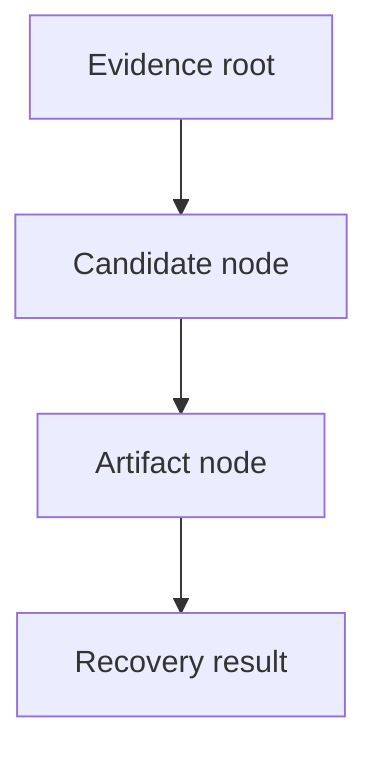

# 10. Audit and Provenance

## 10.1 Audit Event Model

The audit layer stores sequence-linked event records with previous and current hashes, timestamps, event type metadata, and optional contextual IDs. This creates a local integrity chain that allows later verification and analysis of event continuity.

The audit model includes case creation, evidence registration, re-verification, job lifecycle updates, sanitization outcomes, recovery events, and report generation.

## 10.2 Chain Verification

The verification process reads the event rows in order, validates contiguous sequence numbers, confirms previous/current hash linkage, and recomputes canonical event hashes. If a breach is found, the outcome identifies the first bad sequence and the reason.

## 10.3 Event Coverage and Fields

| Field | Meaning |
|---|---|
| Event ID | Unique audit record reference |
| Sequence | Monotonic row ordering for the chain |
| Event type | Stable operation classification |
| Timestamp | Event creation time |
| Actor / object / job | Optional contextual references |
| Details | JSON payload for event-specific facts |
| Previous hash | Link to the prior chain entry |
| Current hash | Canonical hash of this event |

## 10.4 Provenance Graph

The provenance graph preserves relationships between evidence, candidates, and artifacts. This provides the essential forensic trace: the source file, the detected candidate, and the accepted recovered artifact all remain linked through persisted references.

## 10.5 Relationship Gaps and Boundaries

The provenance layer is designed for operational traceability, but it is not a complete replacement for a full forensic lineage system. Some job/report relationships and confidence reconstruction paths remain intentionally scoped to the present implementation. The system reports those boundaries openly.

## 10.6 Tests and References

The repository includes audit and provenance tests covering chain integrity and graph persistence. See:

- `crates/kryvora-audit/tests/chain.rs`
- `crates/kryvora-provenance/tests/graph.rs`
- `crates/kryvora-provenance/tests/chain.rs`

See also [12. Validation and Testing](12_VALIDATION_AND_TESTING.md).
